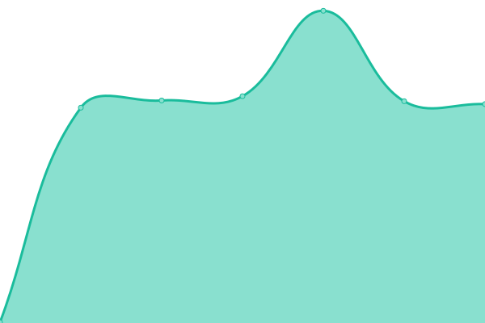
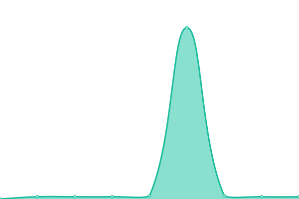

# [📈 Live Status](https://Cosmic-Ray-Station.github.io/upptime): <!--live status--> **🟧 Partial outage**

This repository contains the open-source uptime monitor and status page for [Cosmic Ray Station](https://cosmicrays.oulu.fi/), powered by [Upptime](https://github.com/upptime/upptime).

With [Upptime](https://upptime.js.org), you can get your own unlimited and free uptime monitor and status page, powered entirely by a GitHub repository. We use [Issues](https://github.com/Cosmic-Ray-Station/upptime/issues) as incident reports, [Actions](https://github.com/Cosmic-Ray-Station/upptime/actions) as uptime monitors, and [Pages](https://Cosmic-Ray-Station.github.io/upptime) for the status page.

<!--start: status pages-->
<!-- This summary is generated by Upptime (https://github.com/upptime/upptime) -->
<!-- Do not edit this manually, your changes will be overwritten -->
<!-- prettier-ignore -->
| URL | Status | History | Response Time | Uptime |
| --- | ------ | ------- | ------------- | ------ |
|  [Cosmicrays.oulu.fi](https://cosmicrays.oulu.fi) | 🟩 Up | [cosmicrays-oulu-fi.yml](https://github.com/Cosmic-Ray-Station/upptime/commits/HEAD/history/cosmicrays-oulu-fi.yml) | 

 843ms
     
 | 

<a href="https://Cosmic-Ray-Station.github.io/upptime/history/cosmicrays-oulu-fi">100.00%</a>
    

|  [Gle.oulu.fi](https://gle.oulu.fi) | 🟩 Up | [gle-oulu-fi.yml](https://github.com/Cosmic-Ray-Station/upptime/commits/HEAD/history/gle-oulu-fi.yml) | 

 999ms
     
 | 

<a href="https://Cosmic-Ray-Station.github.io/upptime/history/gle-oulu-fi">100.00%</a>
    

|  [Cosmicrays Data Request](https://cosmicrays.oulu.fi/webform/onlinequery.cgi?station=DOMC&startday=17&startmonth=02&startyear=2022&starttime=00%3A00&endday=17&endmonth=07&endyear=2022&endtime=00%3A00&resolution=Automatic+choice&outputmode=default) | 🟩 Up | [cosmicrays-data-request.yml](https://github.com/Cosmic-Ray-Station/upptime/commits/HEAD/history/cosmicrays-data-request.yml) | 

 363ms
     
 | 

<a href="https://Cosmic-Ray-Station.github.io/upptime/history/cosmicrays-data-request">100.00%</a>
    

|  [Cosmicrays Data API](https://cosmicrays.oulu.fi/api/nmdata) | 🟥 Down | [cosmicrays-data-api.yml](https://github.com/Cosmic-Ray-Station/upptime/commits/HEAD/history/cosmicrays-data-api.yml) | 

 161ms
     
 | 

<a href="https://Cosmic-Ray-Station.github.io/upptime/history/cosmicrays-data-api">100.00%</a>
    

<!--end: status pages-->

[**Visit our status website →**](https://Cosmic-Ray-Station.github.io/upptime)

## 📄 License

- Powered by: [Upptime](https://github.com/upptime/upptime)
- Code: [MIT](./LICENSE) © [Cosmic Ray Station](https://cosmicrays.oulu.fi/)
- Data in the `./history` directory: [Open Database License](https://opendatacommons.org/licenses/odbl/1-0/)
